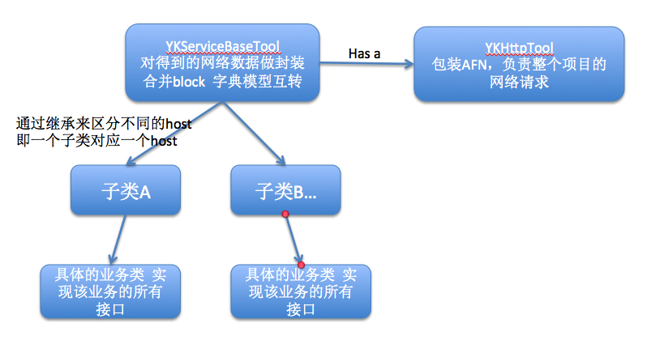

# YKNetWorkApi
结合AFNetworking 和 MJExtension的二次网络请求的封装


### 说明
YKNetWorkApi 是对AFNetwork轻量级二次封装，结合MJExtension让网络请求数据更加简单直接，精简AFN网络请求后的block回调，同时针对网络请求返回的json进行模型转化，从而快速的面向模型进行业务开发。YKNetWorkApi包装了get post put delete四种常用的网络请求，还有post图片上传；同时单独利用NSURLConnection实现了put上传图片你的方法(公司特殊需求，内部有httpBody参数拼接的格式);

### 没有的功能  
YKNetWorkApi是轻量级的二次封装，如果你的应用中要设置请求之间的依赖，请求暂停等之类功能，那么不适合使用本套类库，当然也可以在YKNetWorkApi的基础上进行填充。  

### 类的关系图  


###YKNetWorkApi的应用场景部分代码

**业务类接口的实现**  

```    
// .h文件
+(void)getDemoDataWithResponseHandler:(responseHandler)Handler;

// .m实现文件  
+(void)getDemoDataWithResponseHandler:(responseHandler)Handler
{
    [self getWithUrl:demoDataUrl param:nil resultClass:[DemoAllData class] responseBlock:Handler];
}

```  
**控制器中的使用**     

```  
-(void)loadNetData
{
    [AppDemoServices getDemoDataWithResponseHandler:^(DemoAllData *dataObj, NSError *error) {
        if (dataObj) {
            [self.datas removeAllObjects];
            [self.datas addObjectsFromArray:dataObj.data];
            [self.tableView reloadData];
        } else {
            NSLog(@"网络请求发生错误");
        }
    }];
}  

```  

### 相关文件的说明  
**YKHttpTool类**：  
对AFN进行直接包装；内部可以统一设置httpHeader，超时设置；  
同时提供了 完整url、json、httpHeader的debug模式下的打印方法，用来调试是再爽不过了；   
   
**YKServiceBaseTool类**  
该类在YKHttpTool基础上进行了字典和模型的转化，同时将请求成功和失败的两个block合并在一个block中，除了方便，在使用时能减少代码行数；  
`typedef void (^responseHandler)(id dataObj, NSError *error);`  
该类额外提供了put上传图片；利用NSURLConnection实现，封装了httpBody繁琐的拼接格式；     
*** 
** 对`+(NSString *)vilidClassName`方法的说明 **  
> 该方法是为了获得YKServiceBaseTool直接子类的类名，通过类名，在库中自带的一个setting.plist文件中获取host地址；  

**对`+(NSString *)compeletHttpUrlWithSubUrl:(NSString *)subUrl`方法的说明 **
> 方法是进行完整的url拼接，追加`https`前缀 (如果是http 自行修改一下)  
> 拼接host从而得到完整的url，如果子类传入的url是完整url，这个方法将无效；    

###YKNetWorkUrlDocument  
这个文件是 字符串常量文件，作者喜欢把出去url中的路径全部以字符串常量的形式记录到这里，除了比较整齐以外，方便进行接口统计和和统一修改，(如果你不喜欢，可以不用，直接删除这个文件)


